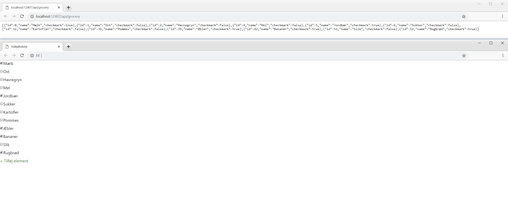

Denne RESTful API er udviklet i det nyere ASP.NET Core, og returnerer data i JSON-format fra en database der repræsenterer en indkøbsliste.

Til at kommunikere med databasen er brugt Entity Framework, og til at præsentere data er oprettet en simpel Client der kommunikerer med API'en via AJAX.

For at teste webservicen's kommunikation med databasen, er brugt Dependency Injection, og et Mock repository.

Det har jeg lært:
- ASP.NET Core
- Entity Framework
- Dependency Injection
- Tests med Mock repository
- M(V)C

